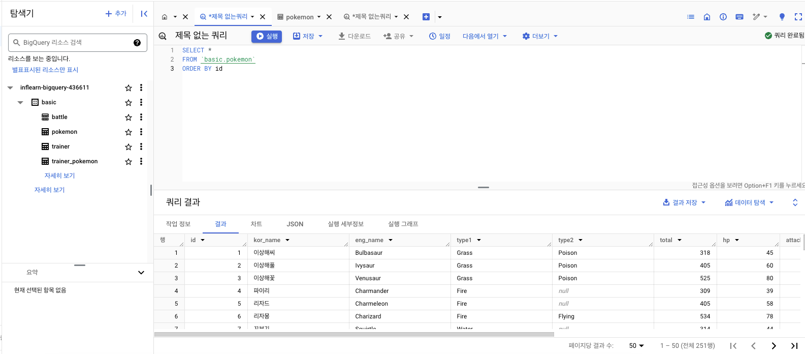
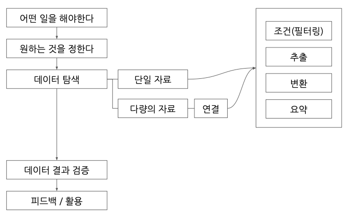

# SQL 1주차
# 1-1. BigQuery 기초 지식
- data: 데이터의 저장소
- table: 데이터가 저장된 공간
- SQL로 데이터 추출

**OLTP**
- Online Transaction Processing
- 거래를 하기 위해 사용되는 데이터베이스
- 데이터의 추가, 데이터의 변경이 많이 발생
- SQL을 사용해 데이터를 추출할 수는 있는데 분석을 위해 만든게 아니라 속도가 느릴수도?

**SQL**
- Structured Query Language
- 데이터베이스에서 데이터를 가지고 올 때 사용

**테이블 데이터의 형태**
- row, column

**OLAP**
- Online Analytical Processing
- 분석을 위한 기능이 제공됨
- Data Warehouse: 데이터 창고
- OLTP보다 빠름

# 1-2. BigQuery 환경설정
**BigQuery의 환경 구성 요소**
- 프로젝트: 하나의 프로젝트에 여러 데이터셋이 존재
- 데이터셋: 하나의 데이터셋에 다양한 테이블이 존재
- 테이블: 행, 열 데이터들이 저장

# 2-1. 데이터 활용 Overview

# 2-2.저장된 데이터 활용하기
쿼리를 작성하기 전에 데이터를 확인하자

**ERD**
- Entity Relationship Diagram
- 데이터베이스 구조를 한눈에 알아보기 위해 사용

**ERD가 없다면?**
- 모든 데이터베이스를 직접 보면서 탐색하기
  - 어떤 테이블이 존재하는가?
  - 어떤 칼럼이 존재하는가?
  - 다른 테이블과 연결할 때 어떤 칼럼을 사용하는가?
  - 칼럼의 값들은 어떤 의미를 가지는가?