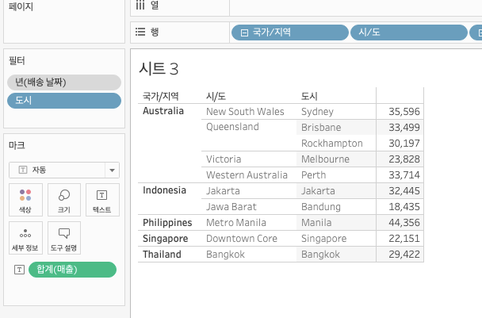
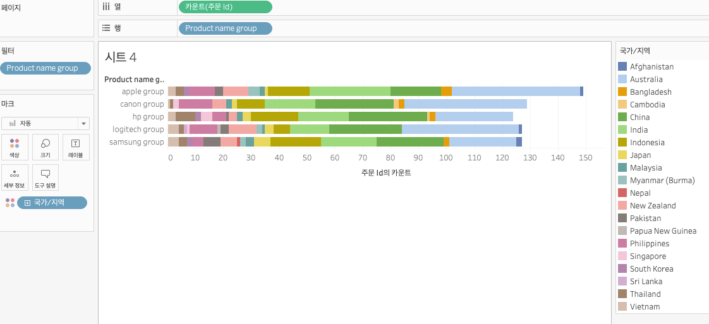

# Third Study Week

- 20강: [파이와 도넛차트](#20강-파이와-도넛차트)

- 21강: [워드와 버블차트](#21강-워드와-버블차트)

- 22강: [이중축과 결합축](#22강-이중축과-결합축)

- 23강: [분산형 차트](#23강-분산형-차트)

- 24강: [히스토그램](#24강-히스토그램)

- 25강: [박스플롯](#25강-박스플롯)

- 26강: [영역차트](#26강-영역차트)

- 27강: [간트차트](#27강-간트차트)

- 28강: [필터](#28강-필터)

- 29강: [그룹](#29강-그룹)


- 문제1 : [문제1](#문제1)

- 문제2 : [문제2](#문제2)

- 참고자료 : [참고자료](#참고-자료)


## Study Schedule

| 강의 범위     | 강의 이수 여부 | 링크                                                                                                        |
|--------------|---------|-----------------------------------------------------------------------------------------------------------|
| 1~9강        |  ✅      | [링크](https://youtu.be/3ovkUe-TP1w?si=CRjj99Qm300unSWt)       |
| 10~19강      | ✅      | [링크](https://www.youtube.com/watch?v=AXkaUrJs-Ko&list=PL87tgIIryGsa5vdz6MsaOEF8PK-YqK3fz&index=75)       |
| 20~29강      | ✅      | [링크](https://www.youtube.com/watch?v=Qcl4l6p-gHM)      |
| 30~39강      | 🍽️      | [링크](https://www.youtube.com/watch?v=e6J0Ljd6h44&list=PL87tgIIryGsa5vdz6MsaOEF8PK-YqK3fz&index=55)       |
| 40~49강      | 🍽️      | [링크](https://www.youtube.com/watch?v=AXkaUrJs-Ko&list=PL87tgIIryGsa5vdz6MsaOEF8PK-YqK3fz&index=45)       |
| 50~59강      | 🍽️      | [링크](https://www.youtube.com/watch?v=AXkaUrJs-Ko&list=PL87tgIIryGsa5vdz6MsaOEF8PK-YqK3fz&index=35)       |
| 60~69강      | 🍽️      | [링크](https://www.youtube.com/watch?v=AXkaUrJs-Ko&list=PL87tgIIryGsa5vdz6MsaOEF8PK-YqK3fz&index=25)       |
| 70~79강      | 🍽️      | [링크](https://www.youtube.com/watch?v=AXkaUrJs-Ko&list=PL87tgIIryGsa5vdz6MsaOEF8PK-YqK3fz&index=15)       |
| 80~89강      | 🍽️      | [링크](https://www.youtube.com/watch?v=AXkaUrJs-Ko&list=PL87tgIIryGsa5vdz6MsaOEF8PK-YqK3fz&index=5)        |


<!-- 여기까진 그대로 둬 주세요-->
<!-- 이 안에 들어오는 텍스트는 주석입니다. -->

# Third Study Week

## 20강: 파이와 도넛차트
<!-- 파이와 도넛차트에 관해 배우게 된 점을 적어주세요 -->
- 파이 차트: 비율 표시
- 도넛 차트: 파이 차트 가운데 구멍

> **🧞‍♀️ 도넛차트를 생성하는 법을 기록해주세요.**
- 임의 축으로 파이차트 복사해서 크기 조절해서 이중축으로 합치면
- 도넛 차트처럼 보이는 차트 완성

## 21강: 워드와 버블차트
<!-- 워드와 버블차트에 관해 배우게 된 점을 적어주세요 -->
- 버블차트: 값에 따라 크기 변화. 색도 주면 3변수
- 워드차트: 텍스트 크기로 표현.

## 22강: 이중축과 결합축
<!-- 이중축과 결합축에 관해 배우게 된 점을 적어주세요 -->
- 이중축은 그래프 양옆에 그래프마다 다른 축(범위)을 사용
- 결합축은 같은 축을 사용


## 23강: 분산형 차트
<!-- 분산형 차트에 관해 배우게 된 점을 적어주세요 -->
- 분산형 차트: 스캐터 &rarr; 상관관계 파악 가능
```js
강의 영상과 달리, 우리 파일에는 '제조 업체' 필드가 없습니다. 필요한 경우, 계산된 필드를 이용해 'SPLIT([제품 이름], ' ', 1)'를 '제조 업체'로 정의하시고 세부 정보에 놓아주세요.
```

## 24강: 히스토그램
<!-- 히스토그램에 관해 배우게 된 점을 적어주세요 -->
- 히스토그램: 연속형 빈도
- 구간차원 편집으로 bin 설정 가능

## 25강: 박스플롯
<!-- 박스플롯에 관해 배우게 된 점을 적어주세요 -->
- 박스플롯: 이상치, 중앙값, 사분위수 등을 한눈에 파악 가능

## 26강: 영역차트
<!-- 영역차트에 관해 배우게 된 점을 적어주세요 -->


## 27강: 간트차트
<!-- 간트차트에 관해 배우게 된 점을 적어주세요 --> 
- 간트차트: 시간 구간 시각화

## 28강: 필터
<!-- 필터에 관해 배우게 된 점을 적어주세요 -->
- 순서: 추출 → 데이터 원본 → 컨텍스트 → 차원 → 측정값 → 필터
- 추출 필터: 최우선, 필요한 데이터만
- 데이터 원본 필터: 라이브 데이터에서 필터링
- 컨텍스트: 필터 중 상위 조건

## 29강: 그룹
<!-- 그룹에 관해 배우게 된 점을 적어주세요 -->
- 그룹, 계층, 집합
- 그룹: 수동으로 필드에 있는 항목을 묶음, 기존 데이터 원본에 없는 사용자 지정 그룹 필드를 만들 수 있음

## 문제 1.

```js
유정이는 superstore 데이터셋에서 '주문' 테이블을 보고 있습니다.
1) 국가/지역 - 시/도- 도시 의 계층을 생성했습니다. 계층 이름은 '위치'로 설정하겠습니다.
2) 날짜의 데이터 타입을 '날짜'로 바꾸었습니다.

코로나 시기의 도시별 매출 top10을 확인하고자
1) 배송 날짜가 코로나시기인 2021년, 2022년에 해당하는 데이터를 필터링했고
2) 위치 계층을 행으로 설정해 펼쳐두었습니다.
이때, 매출의 합계가 TOP 10인 도시들만을 보았습니다.
```


```
겉보기에는 전체 10개로, 잘 나온 결과처럼 보입니다. 그러나 유정이는 치명적인 실수를 저질렀습니다.
오늘 배운 '컨텍스트 필터'의 내용을 고려하여 올바른 풀이 및 결과를 구해주세요.
```

<!-- DArt-B superstore가 아닌 개인 superstore 파일을 사용했다면 값이 다르게 표시될 수 있습니다.-->

> 답   
> 지금은 필터에 상하관계가 걸려있지 않기 때문에 Top10은 전체 매출 기준으로 잡히고, 보여지는 sum만 연도 필터가 결려있다.   
> 코로나 시기의 도시별 매출 Top10을 확인하기 위해서는 연도 필터를 컨텍스트로 걸어야 한다.




## 문제 2.

```js
태영이는 관심이 있는 제품사들이 있습니다. '제품 이름' 필드에서 '삼성'으로 시작하는 제품들을 'Samsung group'으로, 'Apple'으로 시작하는 제품들을 'Apple group'으로, 'Canon'으로 시작하는 제품들을 'Canon group'으로, 'HP'로 시작하는 제품들을 'HP group', 'Logitech'으로 시작하는 제품들을 'Logitech group'으로 그룹화해서 보려고 합니다. 나머지는 기타로 설정해주세요. 이 그룹화를 명명하는 필드는 'Product Name Group'으로 설정해주세요.

(이때, 드래그보다는 멤버 찾기 > 시작 문자 설정하여 모두 찾아 한번에 그룹화해 확인해보세요.)
```


```js
해당 그룹별로 어떤 국가/지역이 주문을 많이 차지하는지를 보고자 합니다. 매출액보다는 주문량을 보고 싶으므로, 주문Id의 카운트로 계산하겠습니다.

기타를 제외하고 지정한 5개의 그룹 하위 목들만을 이용해 아래와 같이 지역별 누적 막대그래프를 그려봐주세요.
```


> 답   
> 1. 일일이 검색해서 그룹을 만든다.
> 2. 나머지는 기타 포함을 체크해 기타로 만든다.
> 3. 카운트(주문 id)와 만든 필드로 막대 그래프를 만들고 기타 그룹은 필터로 제거한다.
> 4. 국가/지역으로 색을 넣는다.

