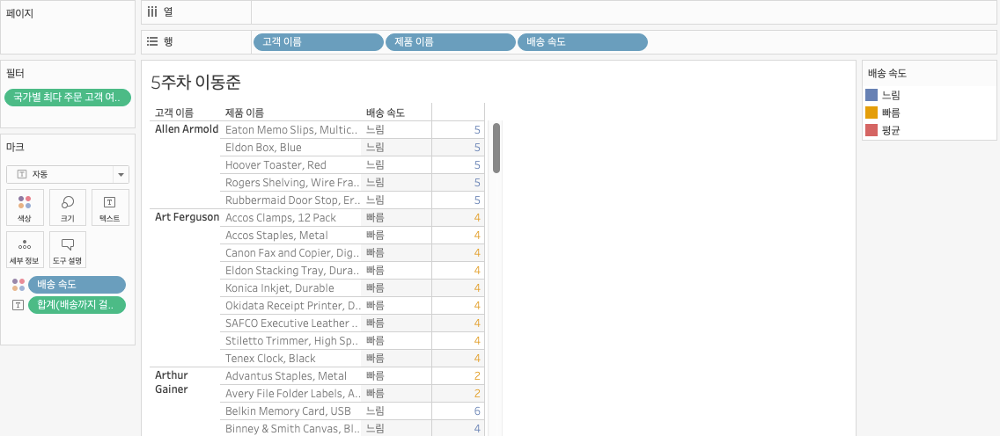
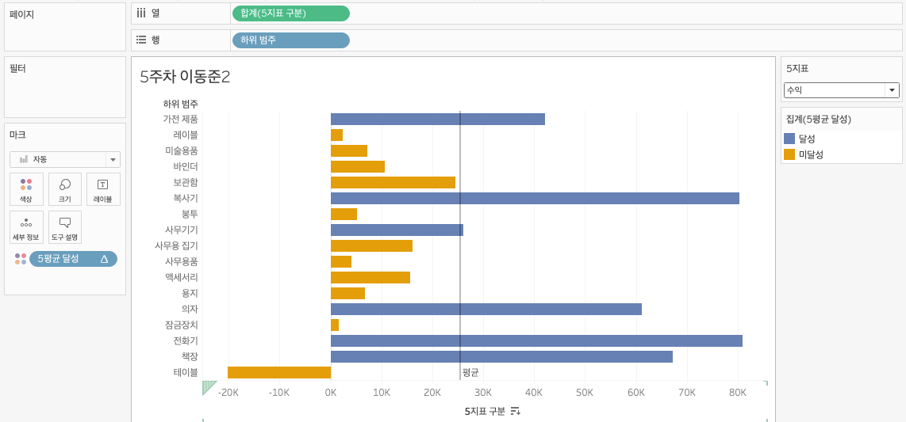

# Fifth Study Week

- 39강: [LOD](#39강-lod)

- 40강: [EXCLUDE](#40-lod-exclude)

- 41강: [INCLUDE](#41-lod-include)

- 42강 : [매개변수](#42-매개변수)

- 43강 : [매개변수 실습](#43-매개변수-실습) : [링크](https://youtu.be/GJvB8hBqeE8?si=3jIj1iymZHZ7mBam)

- 44강: [매개변수 실습](#44-매개변수-실습)

- 45강: [마크카드](#45-워크시트-마크카드)

- 46강: [서식계층](#46-서식-계층)

- 47강: [워크시트](#47-워크시트-서식)

- [문제1](#문제-1)

- [문제2](#문제-2)

## Study Schedule

| 강의 범위     | 강의 이수 여부 | 링크                                                                                                        |
|--------------|---------|-----------------------------------------------------------------------------------------------------------|
| 1~9강        |  ✅      | [링크](https://www.youtube.com/watch?v=AXkaUrJs-Ko&list=PL87tgIIryGsa5vdz6MsaOEF8PK-YqK3fz&index=84)       |
| 10~19강      | ✅      | [링크](https://www.youtube.com/watch?v=AXkaUrJs-Ko&list=PL87tgIIryGsa5vdz6MsaOEF8PK-YqK3fz&index=75)       |
| 20~29강      | ✅      | [링크](https://www.youtube.com/watch?v=AXkaUrJs-Ko&list=PL87tgIIryGsa5vdz6MsaOEF8PK-YqK3fz&index=65)       |
| 30~38강      | ✅      | [링크](https://www.youtube.com/watch?v=e6J0Ljd6h44&list=PL87tgIIryGsa5vdz6MsaOEF8PK-YqK3fz&index=55)       |
| 39~47강      | ✅      | [링크](https://www.youtube.com/watch?v=AXkaUrJs-Ko&list=PL87tgIIryGsa5vdz6MsaOEF8PK-YqK3fz&index=45)       |
| 48~59강      | 🍽️      | [링크](https://www.youtube.com/watch?v=AXkaUrJs-Ko&list=PL87tgIIryGsa5vdz6MsaOEF8PK-YqK3fz&index=35)       |
| 60~69강      | 🍽️      | [링크](https://www.youtube.com/watch?v=AXkaUrJs-Ko&list=PL87tgIIryGsa5vdz6MsaOEF8PK-YqK3fz&index=25)       |
| 70~79강      | 🍽️      | [링크](https://www.youtube.com/watch?v=AXkaUrJs-Ko&list=PL87tgIIryGsa5vdz6MsaOEF8PK-YqK3fz&index=15)       |
| 80~89강      | 🍽️      | [링크](https://www.youtube.com/watch?v=AXkaUrJs-Ko&list=PL87tgIIryGsa5vdz6MsaOEF8PK-YqK3fz&index=5)        |


<!-- 여기까진 그대로 둬 주세요-->

> **🧞‍♀️ 오늘의 스터디는 지니와 함께합니다.**


## 39강. LOD

<!-- INCLUDE, EXCLUDE, FIXED 등 본 강의에서 알게 된 LOD 표현식에 대해 알게 된 점을 적어주세요. -->
- LOD: Level of Detail
- 뷰의 세부 수준을 나타냄
- 현재 뷰에는 영향을 받지 않고, 계산할 수준을 세부적으로 제어 가능
    
- Fixed: 현재 뷰에 있는 차원과 상관 없이 계산된 필드에서 원하는 차원을 따라 계산
  - Fixed에서 설정한 차원이 뷰에 포함되어 있을 때
  - Fixed에서 설정한 차원이 뷰에 포함되어 있지 않을 때

## 40. LOD EXCLUDE

<!-- INCLUDE, EXCLUDE, FIXED 등 본 강의에서 알게 된 LOD 표현식에 대해 알게 된 점을 적고, 아래 두 질문에 답해보세요 :) -->
- Exclude: 현재 뷰에서 특정 차원을 제외하고 계산


> **🧞‍♀️ FIXED와 EXCLUDE을 사용하는 경우의 차이가 무엇인가요?**

```
하위 범주로 내리거나 선택 변경할 경우 FIXED는 변경되지 않지만 EXCLUDE는 변경됨
FIXED는 현재 뷰와 관계 없이 특정 차원을 사용해 계산하기 떄문에 필터의 영향을 받지 않지만
EXCLUDE는 뷰에 있는 차원을 따라 계산하기 떄문에 관련 차원을 필터로 걸면 영향을 받는다
```

> **🧞‍♀️ 왜 ATTR 함수를 사용하나요?**

```
단일 값을 반환 받아서 집계 수준을 맞춰야 함
```


## 41. LOD INCLUDE

<!-- INCLUDE, EXCLUDE, FIXED 등 본 강의에서 알게 된 LOD 표현식에 대해 알게 된 점을 적고, 아래 두 질문에 답해보세요 :) -->
- INCLUDE: 현재 뷰에서 특정 차원을 추가하여 계산

> **🧞‍♀️ 그렇다면 어떤 경우에 각 표현식을 사용하나요? 예시와 함께 적어보아요**


```
뷰에 표시되는 값이 차원: FIXED만 가능
FIXED: 차원과 측정값을 반환
INCLUDE, EXCLUDE: 측정값만 반환
반환 값이 차원 필터를 영향을 받게 되는 경우: INCLUDE, EXCLUDE

```

## 42. 매개변수

<!-- 매개변수에 대해 알게 된 점을 적어주세요 -->
- 고정된 상수값이 아닌 동적인 값으로 변경하기 위해서 활용하는 기능
- 계산식, 필터, 참조선과 함께 사용

> **🧞‍♀️ 집합에도 매개변수를 적용할 수 있나요? 시도해봅시다**
- 네
- 집합 - 상위 - 필드기준 '상위 제품 범주' - 마크 - 색상 설정

## 43. 매개변수 실습
<!-- 영상 묶음에 포함되지 않아 찾기 어려우실까 링크를 아래에 첨부하겠습니다. 수강 후 삭제해주세요-->
- 계산식
- 심플하게 차원 변경
- 매개변수는 단독 사용 불가 → 계산된 필드 필요

## 44. 매개변수 실습

<!-- 매개변수에 대해 알게 된 점을 적어주세요 -->
- 참조선

## 45. 워크시트 마크카드

<!-- 마크카드에 대해 알게 된 점을 적어주세요 -->
- 해당 시트에 있는 데이터: 마크
- 마크 유형 설정: 색상, 모양 등
- 차트 유형에 따라 6번쨰 옵션 등장: 경로
  - 라인 차트는 라인 유형
  - 원은 마크 모양 옵션


## 46. 서식 계층

<!-- 서식계층에 대해 알게 된 점을 적어주세요 -->
- 아래 계층에서 서식을 변경하면 아래 계층에 적용됨
- 서식 탭 → 워크시트 서식 지우기 하면 마크 카드에서 설정한 서식 이전의 서식이 모두 지워짐

> **🧞‍♀️ 서식계층을 일반적인 것에서 구체적인 것 순서로 기입해보세요**


```
워크 시트 서식
행/열 서식
특정 필드
필드 레이블
도구설명/제목/마크
```


## 47. 워크시트 서식

<!-- 워크시트 서식에 대해 알게 된 점을 적어주세요!-->
- 글꼴, 맞춤, 음영
- 음영 서식 구간 크기 → 건너 건너


## 문제 리스트


## 문제 1.

```
가장 많이 주문한 사람들은 물건 배송을 빨리 받았을까요?
조건을 준수하여 아래 이미지를 만들어봆시다.
1) 국가/지역별(이하 '나라'로 통칭), 범주별로 배송일자가 다를 수 있으니 먼저, 나라별/범주별로 평균 배송일자를 설정한 뒤,
2) 각 나라에서 가장 많이 주문한 사람의 이름을 첫 번째 열,
3) 그 사람이 주문한 제품 이름을 2번째 열,
4) 각 상품이 배송까지 걸린 날 수를 표현하고
5) 그리고 만약 배송이 각 나라/범주별 평균보다 빨랐다면 '빠름', 같다면 '평균', 느리다면 '느림' 으로 print 해주세요. 
```


<!-- 여기까지 오는 과정 중 알게 된 점을 기입하고, 결과는 시트 명을 본인 이름으로 바꾸어 표시해주세요.-->
- 배송까지 걸린 날
- 국가/지역, 범주 평균 배송기간
- 배송속도
- 국가별 최다 주문 고객
- 고객주문수
- 국가별 최다 주문 고객 여부 → 필터


## 문제 2.

```
채원이는 태블로를 쓰실 수 없는 상사분께 보고하기 위한 대시보드를 만들고 싶어요. 

제품 중분류별로 구분하되 매개변수로써 수익, 매출, 수량을 입력하면 저절로 각각 지표에 해당하는 그래프로 바뀌도록 설계하고자 해요.

 어떤 값이 각 지표의 평균보다 낮은 값을 갖고 있다면 색깔을 주황색으로, 그것보다 높다면 파란색으로 표시하고 싶어요. 그 평균값은 각 지표별로 달라야 해요.
```



<!-- 예시 사진은 지워주세요-->
- LOD 쓰는 문제인 줄 알았는데, 그냥 window_avg 썼더니 풀렸다...
- 예시 사진은 평균이 아닌 것 같아요