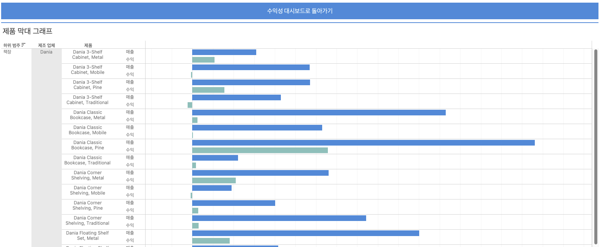
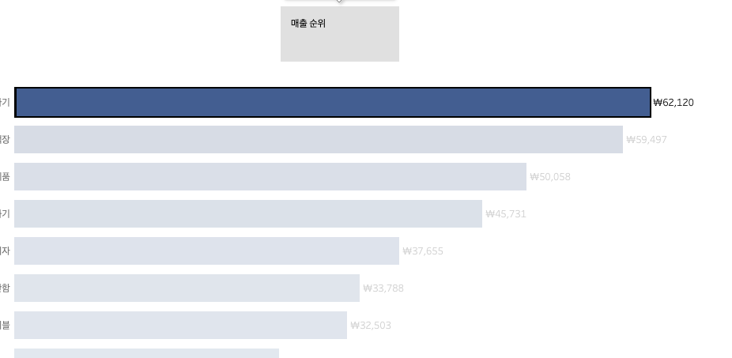

# 7th Study Week

## Study Schedule
 

| 회차 | 강의 범위   | 강의 이수 여부 | 링크                                                                                                     |
|------|-------------|----------------|--------------------------------------------------------------------------------------------------------|
| 1    | 1~7강       | ✅              | [링크](https://www.youtube.com/watch?v=AXkaUrJs-Ko&list=PL87tgIIryGsa5vdz6MsaOEF8PK-YqK3fz&index=84)    |
| 2    | 8~17강      | ✅              | [링크](https://www.youtube.com/watch?v=AXkaUrJs-Ko&list=PL87tgIIryGsa5vdz6MsaOEF8PK-YqK3fz&index=75)    |
| 3    | 18~27강     | ✅              | [링크](https://www.youtube.com/watch?v=AXkaUrJs-Ko&list=PL87tgIIryGsa5vdz6MsaOEF8PK-YqK3fz&index=65)    |
| 4    | 28~37강     | ✅              | [링크](https://www.youtube.com/watch?v=e6J0Ljd6h44&list=PL87tgIIryGsa5vdz6MsaOEF8PK-YqK3fz&index=55)    |
| 5    | 38~47강     | ✅              | [링크](https://www.youtube.com/watch?v=AXkaUrJs-Ko&list=PL87tgIIryGsa5vdz6MsaOEF8PK-YqK3fz&index=45)    |
| 6    | 48~57강     | ✅              | [링크](https://www.youtube.com/watch?v=AXkaUrJs-Ko&list=PL87tgIIryGsa5vdz6MsaOEF8PK-YqK3fz&index=35)    |
| 7    | 58~66강     | ✅             | [링크](https://www.youtube.com/watch?v=AXkaUrJs-Ko&list=PL87tgIIryGsa5vdz6MsaOEF8PK-YqK3fz&index=25)    |
| 8    | 67~77강     | 🍽️             | [링크](https://www.youtube.com/watch?v=AXkaUrJs-Ko&list=PL87tgIIryGsa5vdz6MsaOEF8PK-YqK3fz&index=15)    |
| 9    | 78~85강     | 🍽️             | [링크](https://www.youtube.com/watch?v=AXkaUrJs-Ko&list=PL87tgIIryGsa5vdz6MsaOEF8PK-YqK3fz&index=5)     |
---

 

> **🧞‍♀️ 오늘은 강의보다 실습과 대시보드 직접 만들기가 더 중요하니, 기록보다는 사고하며 강의를 들어주세요.**
> **직접 실습파일을 다운로드하는 번거로움이 있어 assignment > 7th_files에 실습파일을 올려두었습니다. 활용해주세요!**

## 58. 집합값 변경

<!-- 집합값 변경 강의에서 알게 된 점을 적어주세요 -->
- 차트에서 요소를 클릭했을 때 하위 범주나 관련 데이터 표시 가능

## 59강. 스토리패널

<!-- 스토리패널 강의에서 알게 된 점을 적어주세요 -->
- 스토리 설정 패널

## 60. 스토리

<!-- 알게 된 점을 적고, 아래 질문에 답해보세요 :) -->
- 워크시트와 대시보드에 설명을 추가

## 61. 대시보드 탐색

<!-- 대시보드 탐색 강의에서 알게 된 점을 적어주세요 -->
- 대시보드 이동
- 이미지는 다른 것으로 변경 가능
- 클릭시 다른 그래프로

## 62. 태블로 단추

<!-- 태블로 단추 강의에서 알게 된 점을 적어주세요 -->
- 표시/숨기기 단추
- x버튼 또는 다른 이미지

## 63. 막대그래프 드릴다운

<!-- 막대그래프 드릴다운에 대해 알게 된 점을 적어주세요 -->
- 분석에 필요한 요약 수준을 바꿈
- 매개변수
- 클릭시 범주로 드릴다운

## 64. 트리맵 드릴다운

<!-- 트리맵 드릴다운에 대해 알게 된 점을 적어주세요 -->
- 하위 범주로 드릴다운
- 집합 → 동작(집합값 변경)
- 각 구역을 유지

## 65. 파이 차트 드릴다운

<!-- 파일 차트 드릴다운에 대해 알게 된 점을 적어주세요 -->
- 거의 동일한 내용
- 외부 파이, 내부 파이로 구분 가능

## 66. 지도 드릴다운

<!-- 지도 드릴다운에 대해 알게 된 점을 적어주세요 -->
- 거의 동일한 내용

---

## 문제

오늘은 별도의 문제가 없습니다.

다만, 학술제 이후 마지막 과제(11/27~)로서 한 주 동안에는 학술제 주제 관련 데이터(없을 경우, 본인 관심 데이터)를 사용해 나만의 대시보드를 제작할 예정입니다. 또한, 학술제에서 시각화 시 태블로를 사용하기를 권장하는 안내가 나갈 예정입니다.
그 때 열심히 배운 내용을 잘 활용해주세요. 감사합니다 :)
